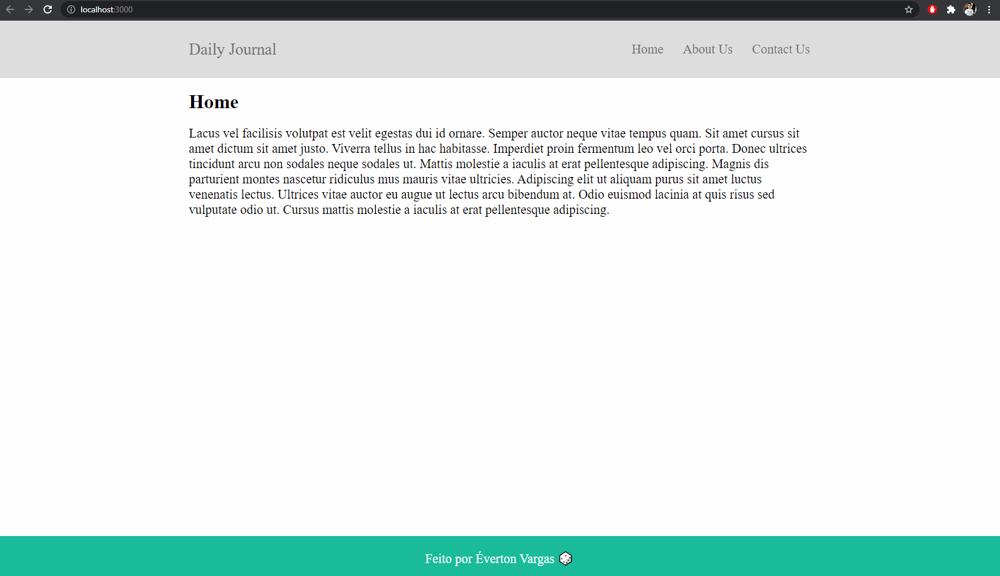

## :file_folder: Site com EJS
O objetivo desse projeto é simular um jornal e a publicação de posts. Com isso foi possível entender como os templates funcionam e como podemos reaproveitar um código em várias páginas. Aprendi também como criar módulos, exportar e importar. 
Desconsiderem o CSS :stuck_out_tongue_winking_eye:

## :rocket: Technologies 
- NodeJS
- Express
- EJS
- Html
- Css
 
## Resultado final:

    

